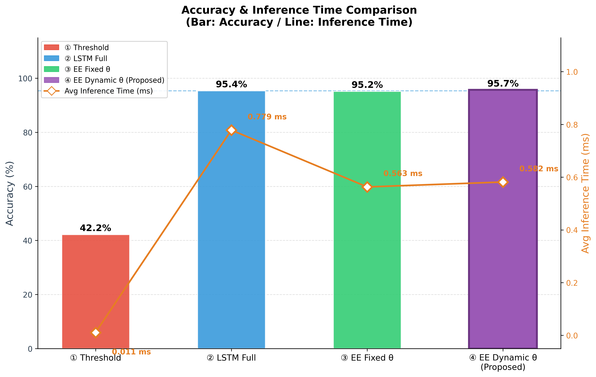
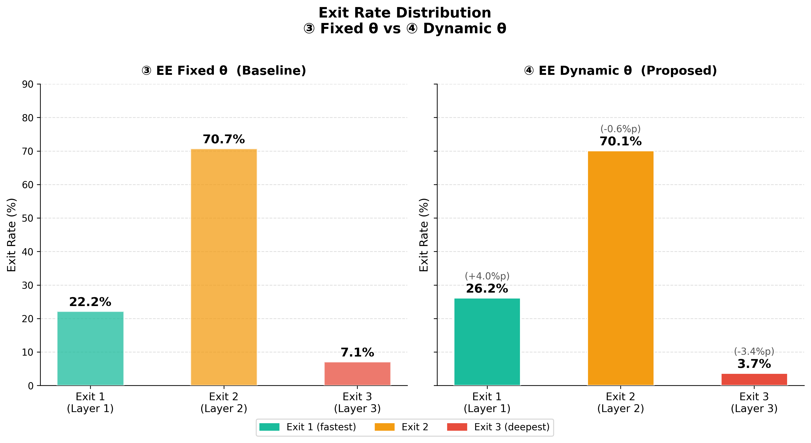
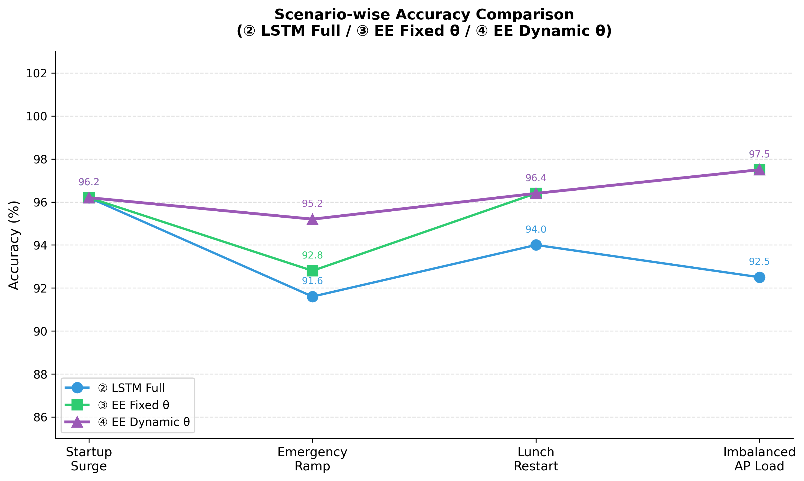
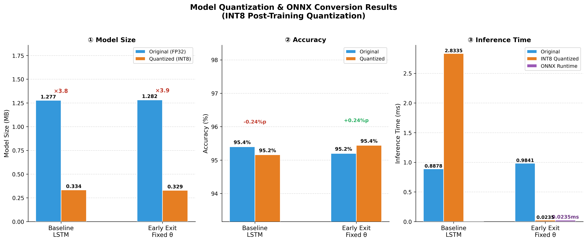

# 장예나 Stage 4 작업 설명

## 작업 목표

3단계 실험 결과(김호중·유용상)를 취합하여 최종 시각화 그래프 4종을 생성하고,  
발표 및 보고서에 바로 사용할 수 있는 형태로 정리했다.

---

## 사용 데이터 (입력)

| 파일 | 경로 | 역할 |
|---|---|---|
| `comparison_summary.csv` | `project/results/hojung/` | 4개 방식 전체 비교 수치 |
| `quantization_comparison.csv` | `project/results/` | INT8 / ONNX 경량화 전후 비교 수치 |

시나리오별 정확도(`scenario_accuracy.png` 생성용)는  
`docs/yongsang/stage3_work_log.md`의 실측값을 코드에 직접 내장했다.  
(이유: `comparison_summary.csv`에 시나리오별 컬럼이 존재하지 않음)

---

## 생성 파일

| 파일명 | 설명 | 저장 위치 |
|---|---|---|
| `accuracy_latency_combined.png` | 정확도(막대) + 추론시간(꺾은선) 통합 이중 축 그래프 | `project/results/yena/` |
| `exit_rate_comparison.png` | Exit 1/2/3 종료율 비교 (③ vs ④) | `project/results/yena/` |
| `scenario_accuracy.png` | 4개 시나리오별 정확도 선그래프 | `project/results/yena/` |
| `quantization_comparison.png` | INT8 / ONNX 경량화 전후 3종 비교 | `project/results/yena/` |
| `visualize_results.py` | 위 4개 그래프를 생성하는 Colab용 스크립트 | `project/scripts/` |

> 모든 그래프는 **dpi=300** 고해상도로 저장하여 발표 슬라이드에 바로 삽입 가능.

---

## 구현 파일

| 파일 | 역할 |
|---|---|
| `project/scripts/visualize_results.py` | 그래프 4종 생성 스크립트 (Colab 실행용) |

---

## 스크립트 실행 방법 (Google Colab)

```bash
# 1. CSV 2개를 Colab 루트에 업로드
#    - comparison_summary.csv
#    - quantization_comparison.csv

# 2. 스크립트 업로드 후 실행
exec(open("visualize_results.py").read())

# 또는 스크립트 내용 전체를 셀에 붙여넣어 실행
```

실행 결과 `results/` 폴더에 png 4개가 자동 저장된다.

---

## 그래프별 설명 및 사용 데이터

### 그래프 1 — 정확도 + 추론시간 통합 (`accuracy_latency_combined.png`)

기존 정확도 막대그래프(그래프 1)와 산점도(그래프 2)를 하나로 통합했다.  
왼쪽 y축에 **정확도(막대그래프)**, 오른쪽 y축에 **추론시간(꺾은선그래프)**을 이중 축으로 표현한다.

| 방식 | 정확도 | 추론시간 |
|---|---:|---:|
| ① Threshold | 42.2% | 0.011ms |
| ② LSTM Full | 95.4% | 0.779ms |
| ③ EE Fixed θ | 95.2% | 0.563ms |
| ④ EE Dynamic θ (제안) | **95.7%** | 0.582ms |

- 막대: 각 방식별 고유 색상, ④ 제안 모델 테두리 강조
- 꺾은선: 주황색 다이아몬드 마커, 각 점 옆에 ms 수치 표시
- ② LSTM Full 기준선(파란 점선) 표시



---

### 그래프 2 — Exit 종료율 비교 (`exit_rate_comparison.png`)

고정 θ(③)와 동적 θ(④)의 Exit 1/2/3 종료율을 나란히 비교한다.

| Exit | ③ Fixed θ | ④ Dynamic θ | 변화 |
|---|---:|---:|---:|
| Exit 1 (Layer 1) | 22.2% | 26.2% | +4.0%p |
| Exit 2 (Layer 2) | 70.7% | 70.1% | -0.6%p |
| Exit 3 (Layer 3) | 7.1% | 3.7% | **-3.4%p** |

동적 θ는 Exit 3(가장 깊은 추론) 비율을 7.1% → 3.7%로 줄여  
안정 구간에서 연산량을 효과적으로 절감했다.



---

### 그래프 3 — 시나리오별 정확도 (`scenario_accuracy.png`)

4개 공장 시나리오별로 ②③④ 방식의 정확도를 선그래프로 비교한다.

| 시나리오 | ② LSTM Full | ③ EE Fixed θ | ④ EE Dynamic θ |
|---|---:|---:|---:|
| Startup Surge (일과 시작) | 96.2% | 96.2% | 96.2% |
| Emergency Ramp (긴급 증산) | 91.6% | 92.8% | **95.2%** |
| Lunch Restart (점심 재가동) | 94.0% | 96.4% | 96.4% |
| Imbalanced AP Load (불균형 부하) | 92.5% | 97.5% | 97.5% |

동적 θ는 트래픽이 갑작스럽게 폭증하는 **Emergency Ramp** 시나리오에서  
고정 θ 대비 +2.4%p, LSTM Full 대비 +3.6%p 높은 정확도를 기록했다.

> 데이터 출처: `docs/yongsang/stage3_work_log.md` — 시나리오별 정확도 표  
> `comparison_summary.csv`에 시나리오별 컬럼이 없어 코드 내 `scenario_data` 딕셔너리에 직접 내장.



---

### 그래프 4 — 경량화 비교 (`quantization_comparison.png`)

INT8 Quantization 및 ONNX Runtime 변환 전후를 모델 크기·정확도·추론 시간  
3가지 축으로 비교한다.

| 모델 | 원본 크기 | 양자화 크기 | 압축률 | 정확도 변화 | ONNX 추론 |
|---|---:|---:|---:|---:|---:|
| Baseline LSTM | 1.277MB | 0.334MB | ×3.8 | -0.24%p | — |
| Early Exit Fixed θ | 1.282MB | 0.329MB | ×3.9 | +0.24%p | **0.0235ms** |

- 두 모델 모두 양자화 후 1MB 이하 달성 (목표치 충족)
- 정확도 변화 ±0.24%p로 허용 기준 2% 이내 방어
- ONNX Runtime 적용 시 Early Exit Fixed θ: 0.9841ms → **0.0235ms** (약 42배 단축)

> **주의:** PyTorch INT8 추론 시간(`quantized_inference_ms`)은 Python 오버헤드로  
> 원본보다 느리게 측정될 수 있다. 실제 배포 속도는 ONNX Runtime 수치를 기준으로 해석할 것.



---

## 동적 θ 한계 분석

`docs/yongsang/stage4_work_log.md` 분석을 바탕으로 정리한 내용이다.

### 현재 구현의 한계

규칙 기반 동적 threshold는 Exit 1 종료율 향상(22.2% → 26.2%)과  
Exit 3 감소(7.1% → 3.7%)에서 효과를 보였으나,  
실측 추론 시간(0.563ms → 0.582ms)은 고정 θ 대비 소폭 증가했다.

원인은 매 샘플마다 수행되는 **변동성 계산(delta) + 조건 분기 + θ 재설정** 오버헤드가  
Exit 1 종료율 향상으로 절약한 시간을 상쇄하기 때문이다.

### 향후 개선 방향

```
1. 경량 동적 θ 계산
   - std 기반 → max-min 범위로 대체 (연산 단순화)
   - K 타임스텝마다 한 번만 갱신 (주기적 업데이트)

2. ONNX Runtime 기준 동적 θ 검증
   - 현재 ONNX 검증은 고정 θ 모델 중심으로 수행됨
   - 동적 θ의 실제 배포 효과는 별도 검증 필요

3. 실제 노이즈 환경 재검증
   - 시뮬레이터 데이터는 패턴이 명확해 고정 θ로도 충분
   - 실제 공장 환경의 불규칙한 변동에서 동적 θ 강건성 재측정 필요
```

---

## 완료 기준 체크리스트

- [x] 김호중 `comparison_summary.csv` 수치 확인 완료
- [x] 김호중 `quantization_comparison.csv` 수치 확인 완료
- [x] 정확도 + 추론시간 통합 그래프 생성 완료 (`accuracy_latency_combined.png`)
- [x] Exit 종료율 비교 그래프 생성 완료 (`exit_rate_comparison.png`)
- [x] 시나리오별 정확도 선그래프 생성 완료 (`scenario_accuracy.png`)
- [x] 경량화 비교 그래프 생성 완료 (`quantization_comparison.png`)
- [x] 동적 θ 한계 분석 정리 완료
- [x] `visualize_results.py` 최종 수정본 저장 완료
- [ ] 김호중·유용상에게 시각화 결과 공유
- [ ] 보고서 데이터·실험 섹션 초안 작성 (Stage 5)

---

## 주의사항

- `visualize_results.py`는 Colab 기준으로 작성됨.  
  로컬 실행 시 상단에 `matplotlib.use('Agg')` 추가 필요.
- 시나리오별 정확도 수치는 `visualize_results.py` 내 `scenario_data` 딕셔너리에 하드코딩되어 있음.  
  실험 결과가 바뀌면 해당 딕셔너리를 직접 수정할 것.
